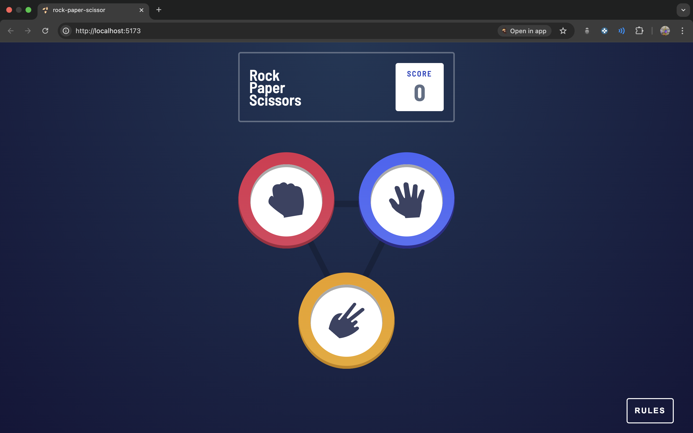

# Rock Paper Scissors Game

A classic Rock-Paper-Scissors game built with React.js, allowing users to play against the computer with an intuitive interface and real-time scoring.

 <!-- Replace with actual screenshot path -->

## 🕹️ Features

- **Interactive Gameplay**: Play against the computer with immediate feedback.
- **Responsive Design**: Optimized for both desktop and mobile devices.
- **Score Tracking**: Keeps track of player and computer scores.
- **Clean UI**: Simple and user-friendly interface.

## 🚀 Getting Started

Follow these instructions to set up and run the project locally.

### Prerequisites

- [Node.js](https://nodejs.org/) (v14 or higher)
- [npm](https://www.npmjs.com/) (v6 or higher)

### Installation

1. **Clone the repository:**

   ```bash
   git clone https://github.com/krishna-nayak/rock-paper-scissors.git
   cd rock-paper-scissors
   ```

2. **Install dependencies:**

   ```bash
   npm install
   ```

3. **Start the development server:**

   ```bash
   npm run dev
   ```

4. **Open in browser:**

   Navigate to `http://localhost:5173` to view the application.

## 🧠 How to Play

1. **Choose Your Move**: Click on Rock, Paper, or Scissors.
2. **Computer's Turn**: The computer randomly selects its move.
3. **View Result**: The outcome (Win, Lose, or Draw) is displayed along with updated scores.
4. **Play Again**: Click to play another round.

## 🛠️ Technologies Used

- **React.js**: Front-end library for building user interfaces.
- **Vite**: Fast build tool and development server.
- **CSS**: Styling the components and layout.

## 📁 Project Structure

```
rock-paper-scissors/
├── public/
│   └── assets/            # Static assets like images
├── src/
│   ├── components/        # Reusable React components
│   ├── App.jsx            # Main application component
│   └── main.jsx           # Entry point
├── .eslintrc.cjs          # ESLint configuration
├── package.json           # Project metadata and scripts
└── vite.config.js         # Vite configuration
```

## ✅ Future Enhancements

- **Persistent Scores**: Save scores using `localStorage` to maintain them across sessions.
- **Game History**: Display a history of previous rounds.
- **Animations**: Add animations for enhanced user experience.
- **Accessibility**: Improve keyboard navigation and screen reader support.

## 🤝 Contributing

Contributions are welcome! Please fork the repository and submit a pull request for any enhancements or bug fixes.

## 📄 License

This project is licensed under the [MIT License](LICENSE).
